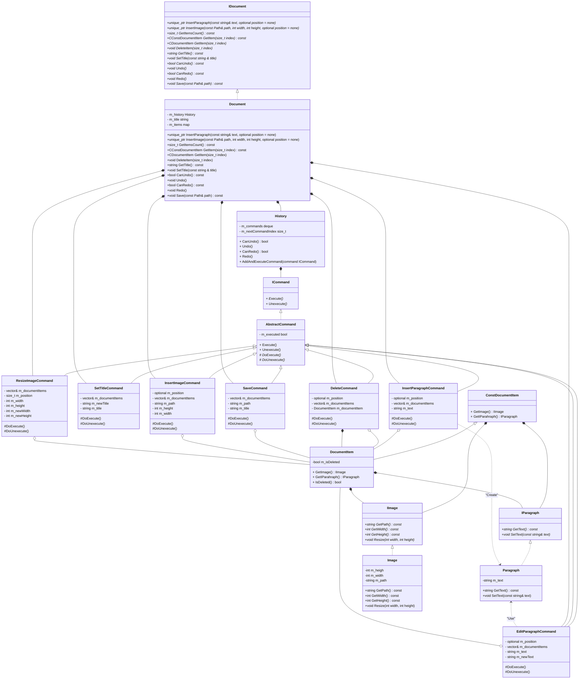

```mermaid
classDiagram

    ICommand <|.. AbstractCommand
    AbstractCommand <|-- InsertParagraphCommand
    AbstractCommand <|-- SetTitleCommand
    AbstractCommand <|-- DeleteCommand
    AbstractCommand <|-- SaveCommand
    AbstractCommand <|-- EditParagraphCommand
    AbstractCommand <|-- InsertImageCommand
    AbstractCommand <|-- EditParagraphCommand
    AbstractCommand <|-- ResizeImageCommand

    IParagraph <|.. Paragraph
    IImage <|.. Image

    History *-- ICommand

    ConstDocumentItem <|-- DocumentItem

    IDocument <|.. Document
    ConstDocumentItem *-- IImage
    ConstDocumentItem *-- IParagraph
    DocumentItem *-- IImage
    DocumentItem *-- IParagraph
    Document *-- History
    Document *-- InsertParagraphCommand
    Document *-- SetTitleCommand
    Document *-- DeleteCommand
    Document *-- SaveCommand
    Document *-- EditParagraphCommand
    Document *-- InsertImageCommand
    Document *-- ResizeImageCommand

    Paragraph <.. InsertParagraphCommand : "Create" 
    Paragraph <.. EditParagraphCommand : "Use"
    InsertParagraphCommand o-- DocumentItem
    DeleteCommand o-- DocumentItem
    DeleteCommand *-- DocumentItem
    SaveCommand o-- DocumentItem
    EditParagraphCommand o-- DocumentItem
    InsertImageCommand o-- DocumentItem
    ResizeImageCommand o-- DocumentItem
    
    class IDocument {
        +unique_ptr InsertParagraph(const string& text, optional<size_t> position = none)*
        +unique_ptr InsertImage(const Path& path, int width, int height, optional<size_t> position = none)*
        +size_t GetItemsCount()* const
        +CConstDocumentItem GetItem(size_t index)* const
        +CDocumentItem GetItem(size_t index)*
        +void DeleteItem(size_t index)*
        +string GetTitle()* const
        +void SetTitle(const string & title)*
        +bool CanUndo()* const
        +void Undo()*
        +bool CanRedo()* const
        +void Redo()*
        +void Save(const Path& path)* const
    }

    class IParagraph {
        +string GetText()* const
        +void SetText(const string& text)*
    }

    class Paragraph {
        +string GetText() const
        +void SetText(const string& text)
        -string m_text
    }

    class IImage {
        +string GetPath()* const
        +int GetWidth()* const
        +int GetHeight()* const
        +void Resize(int width, int height)*
    }

    class Image {
        +string GetPath() const
        +int GetWidth() const
        +int GetHeight() const
        +void Resize(int width, int height)
        -int m_heigh
        -int m_width
        -string m_path
    }

    class ConstDocumentItem {
        + GetImage() IImage
        + GetIParahraph() IParagraph
    }

    class DocumentItem {
        + GetImage() IImage
        + GetIParahraph() IParagraph
        + IsDeleted() bool
        -bool m_isDeleted
    }

    class ICommand {
        + Execute()*
        + Unexecute()*
    }

    class AbstractCommand {
        + Execute()
        + Unexecute()
        # DoExecute()*
        # DoUnexecute()*
        - m_executed bool
    }

    class History {
        + CanUndo() bool
        + Undo()
        + CanRedo() bool
        + Redo()
        + AddAndExecuteCommand(command ICommand)
        - m_commands deque<ICommand>
        - m_nextCommandIndex size_t
    }

    class Document {
        +unique_ptr InsertParagraph(const string& text, optional<size_t> position = none)
        +unique_ptr InsertImage(const Path& path, int width, int height, optional<size_t> position = none)
        +size_t GetItemsCount() const
        +CConstDocumentItem GetItem(size_t index) const
        +CDocumentItem GetItem(size_t index)
        +void DeleteItem(size_t index)
        +string GetTitle() const
        +void SetTitle(const string & title)
        +bool CanUndo() const
        +void Undo()
        +bool CanRedo() const
        +void Redo()
        +void Save(const Path& path) const
        - m_history History
        - m_title string
        - m_items map<DocumentItem>
    }

    class InsertParagraphCommand {
        - optional<size_t> m_position
        - vector<DocumentItem>& m_documentItems
        - string m_text
        #DoExecute()
        #DoUnexecute()
    }

    class InsertImageCommand {
        - optional<size_t> m_position
        - vector<DocumentItem>& m_documentItems
        - string m_path
        - int m_height
        - int m_width
        #DoExecute()
        #DoUnexecute()
    }

    class DeleteCommand {
        - optional<size_t> m_position
        - vector<DocumentItem>& m_documentItems
        - DocumentItem m_documentItem
        #DoExecute()
        #DoUnexecute()
    }

    class SetTitleCommand {
        - vector<DocumentItem>& m_documentItems
        - string m_newTitle
        - string m_title
        #DoExecute()
        #DoUnexecute()
    }

    class ResizeImageCommand {
        - vector<DocumentItem>& m_documentItems
        - size_t m_position
        - int m_width
        - int m_height
        - int m_newWidth
        - int m_newHeight
        #DoExecute()
        #DoUnexecute()
    }

    class EditParagraphCommand {
        - optional<size_t> m_position
        - vector<DocumentItem>& m_documentItems
        - string m_text
        - string m_newText
        #DoExecute()
        #DoUnexecute()
    }

    class SaveCommand {
        - vector<DocumentItem>& m_documentItems
        - string m_path
        - string m_title
        #DoExecute()
        #DoUnexecute()
    }

```