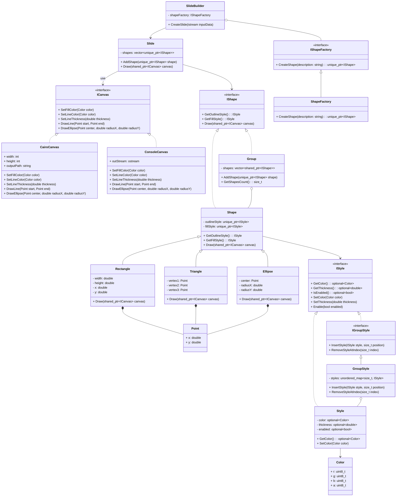

```mermaid
classDiagram
%% Canvas Section
    class ICanvas {
        <<interface>>
        + SetFillColor(Color color)
        + SetLineColor(Color color)
        + SetLineThickness(double thickness)
        + DrawLine(Point start, Point end)
        + DrawEllipse(Point center, double radiusX, double radiusY)
    }

    class CairoCanvas {
        + width: int
        + height: int
        + outputPath: string
        + SetFillColor(Color color)
        + SetLineColor(Color color)
        + SetLineThickness(double thickness)
        + DrawLine(Point start, Point end)
        + DrawEllipse(Point center, double radiusX, double radiusY)
    }

    class ConsoleCanvas {
        + outStream: ostream
        + SetFillColor(Color color)
        + SetLineColor(Color color)
        + SetLineThickness(double thickness)
        + DrawLine(Point start, Point end)
        + DrawEllipse(Point center, double radiusX, double radiusY)
    }

    ICanvas <|.. CairoCanvas
    ICanvas <|.. ConsoleCanvas

%% Shape Section
    class IShape {
        <<interface>>
        + GetOutlineStyle(): IStyle
        + GetFillStyle(): IStyle
        + Draw(shared_ptr~ICanvas~ canvas)
    }

    class Shape {
        - outlineStyle: unique_ptr~IStyle~
        - fillStyle: unique_ptr~IStyle~
        + GetOutlineStyle(): IStyle
        + GetFillStyle(): IStyle
        + Draw(shared_ptr~ICanvas~ canvas)
    }

    class Point {
        + x: double
        + y: double
    }

    class Triangle {
        - vertex1: Point
        - vertex2: Point
        - vertex3: Point
        + Draw(shared_ptr~ICanvas~ canvas)
    }

    class Ellipse {
        - center: Point
        - radiusX: double
        - radiusY: double
        + Draw(shared_ptr~ICanvas~ canvas)
    }

    class Rectangle {
        - width: double
        - height: double
        - x: double
        - y: double
        + Draw(shared_ptr~ICanvas~ canvas)
    }

    class Group {
        - shapes: vector~shared_ptr~IShape~~
        + AddShape(unique_ptr~IShape~ shape)
        + GetShapesCount(): size_t
    }

    IShape <|.. Shape
    Shape <|-- Triangle
    Shape <|-- Ellipse
    Shape <|-- Rectangle
    IShape <|.. Group
    Rectangle *-- Point
    Triangle *-- Point
    Ellipse *-- Point
    Group o-- Shape

%% ShapeFactory Section
    class IShapeFactory {
        <<interface>>
        + CreateShape(description: string): unique_ptr~IShape~
    }

    class ShapeFactory {
        + CreateShape(description: string): unique_ptr~IShape~
    }

    IShapeFactory <|-- ShapeFactory

%% Slide Section
    class Slide {
        - shapes: vector~unique_ptr~IShape~~
        + AddShape(unique_ptr~IShape~ shape)
        + Draw(shared_ptr~ICanvas~ canvas)
    }

    class SlideBuilder {
        - shapeFactory: IShapeFactory
        + CreateSlide(istream inputData)
    }

    SlideBuilder --> Slide
    Slide --> IShape

%% Style Section
    class IStyle {
        <<interface>>
        + GetColor(): optional~Color~
        + GetThickness(): optional~double~
        + IsEnabled(): optional~bool~
        + SetColor(Color color)
        + SetThickness(double thickness)
        + Enable(bool enabled)
    }

    class Style {
        - color: optional~Color~
        - thickness: optional~double~
        - enabled: optional~bool~
        + GetColor(): optional~Color~
        + SetColor(Color color)
    }

    class Color {
        + r: uint8_t
        + g: uint8_t
        + b: uint8_t
        + a: uint8_t
    }

    class IGroupStyle {
        <<interface>>
        + InsertStyle(IStyle style, size_t position)
        + RemoveStyleAtIndex(size_t index)
    }

    class GroupStyle {
        - styles: unordered_map~size_t, IStyle~
        + InsertStyle(IStyle style, size_t position)
        + RemoveStyleAtIndex(size_t index)
    }

    IStyle <|.. Style
    IStyle <|.. IGroupStyle
    IGroupStyle <|-- GroupStyle
    GroupStyle o-- Style
    Style --> Color
    Shape --> IStyle


    SlideBuilder o-- IShapeFactory
    Slide --> ICanvas : use
```

Стиль группы  дол