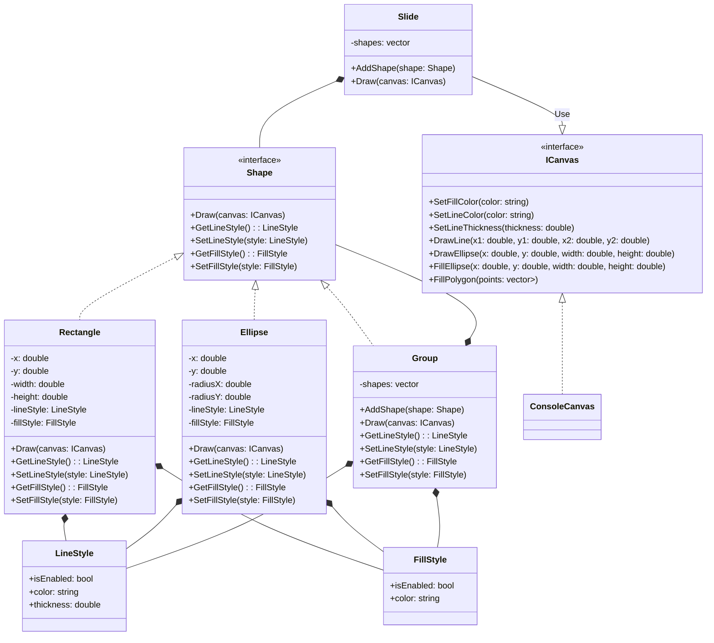

```mermaid
classDiagram
    class ICanvas {
        <<interface>>
        +SetFillColor(color: string)
        +SetLineColor(color: string)
        +SetLineThickness(thickness: double)
        +DrawLine(x1: double, y1: double, x2: double, y2: double)
        +DrawEllipse(x: double, y: double, width: double, height: double)
        +FillEllipse(x: double, y: double, width: double, height: double)
        +FillPolygon(points: vector<pair<double, double>>)
    }

    class LineStyle {
        +isEnabled: bool
        +color: string
        +thickness: double
    }

    class FillStyle {
        +isEnabled: bool
        +color: string
    }

    class Shape {
        <<interface>>
        +Draw(canvas: ICanvas)
        +GetLineStyle(): LineStyle
        +SetLineStyle(style: LineStyle)
        +GetFillStyle(): FillStyle
        +SetFillStyle(style: FillStyle)
    }

    class Rectangle {
        -x: double
        -y: double
        -width: double
        -height: double
        -lineStyle: LineStyle
        -fillStyle: FillStyle
        +Draw(canvas: ICanvas)
        +GetLineStyle(): LineStyle
        +SetLineStyle(style: LineStyle)
        +GetFillStyle(): FillStyle
        +SetFillStyle(style: FillStyle)
    }

    class Ellipse {
        -x: double
        -y: double
        -radiusX: double
        -radiusY: double
        -lineStyle: LineStyle
        -fillStyle: FillStyle
        +Draw(canvas: ICanvas)
        +GetLineStyle(): LineStyle
        +SetLineStyle(style: LineStyle)
        +GetFillStyle(): FillStyle
        +SetFillStyle(style: FillStyle)
    }

    class Group {
        -shapes: vector<Shape>
        +AddShape(shape: Shape)
        +Draw(canvas: ICanvas)
        +GetLineStyle(): LineStyle
        +SetLineStyle(style: LineStyle)
        +GetFillStyle(): FillStyle
        +SetFillStyle(style: FillStyle)
    }

    class Slide {
        -shapes: vector<Shape>
        +AddShape(shape: Shape)
        +Draw(canvas: ICanvas)
    }

    ICanvas <|.. ConsoleCanvas
    Shape <|.. Rectangle
    Shape <|.. Ellipse
    Shape <|.. Group
    Slide *-- Shape
    Group *-- Shape
    Rectangle *-- LineStyle
    Rectangle *-- FillStyle
    Ellipse *-- LineStyle
    Ellipse *-- FillStyle
    Group *-- LineStyle
    Group *-- FillStyle
    Slide --|> ICanvas : Use
```