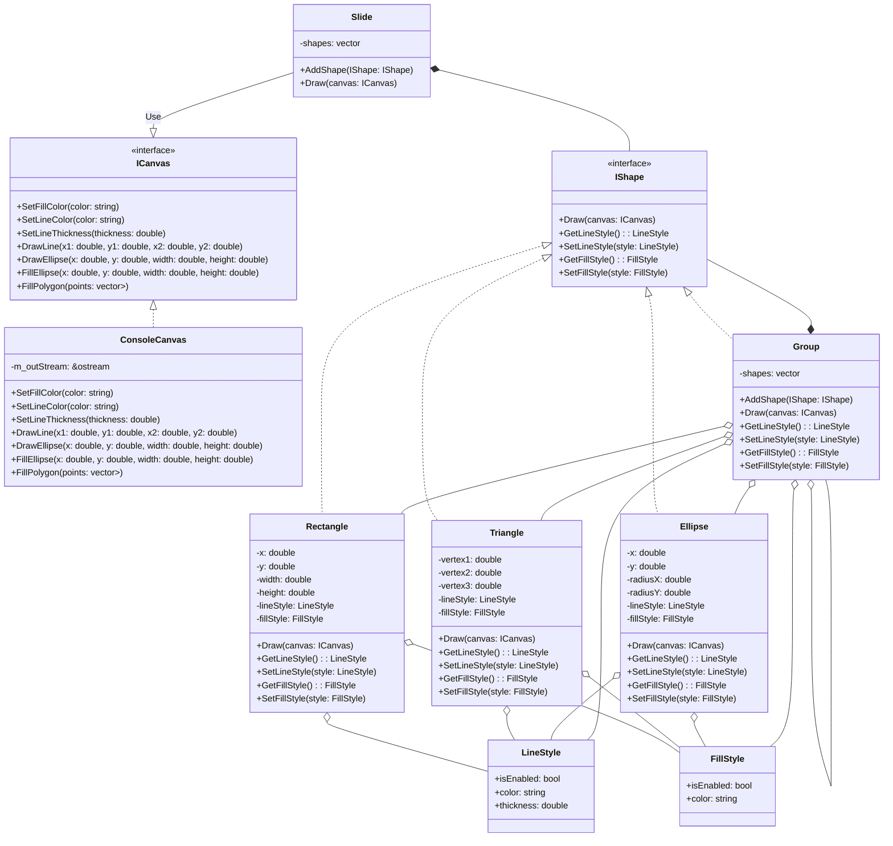

```mermaid
classDiagram
    class ICanvas {
        <<interface>>
        +SetFillColor(color: string)
        +SetLineColor(color: string)
        +SetLineThickness(thickness: double)
        +DrawLine(x1: double, y1: double, x2: double, y2: double)
        +DrawEllipse(x: double, y: double, width: double, height: double)
        +FillEllipse(x: double, y: double, width: double, height: double)
        +FillPolygon(points: vector<pair<double, double>>)
    }
    
    class ConsoleCanvas {
        -m_outStream: &ostream
        +SetFillColor(color: string)
        +SetLineColor(color: string)
        +SetLineThickness(thickness: double)
        +DrawLine(x1: double, y1: double, x2: double, y2: double)
        +DrawEllipse(x: double, y: double, width: double, height: double)
        +FillEllipse(x: double, y: double, width: double, height: double)
        +FillPolygon(points: vector<pair<double, double>>)
    }

    class LineStyle {
        +isEnabled: bool
        +color: string
        +thickness: double
    }

    class FillStyle {
        +isEnabled: bool
        +color: string
    }

    class IShape {
        <<interface>>
        +Draw(canvas: ICanvas)
        +GetLineStyle(): LineStyle
        +SetLineStyle(style: LineStyle)
        +GetFillStyle(): FillStyle
        +SetFillStyle(style: FillStyle)
    }

    class Rectangle {
        -x: double
        -y: double
        -width: double
        -height: double
        -lineStyle: LineStyle
        -fillStyle: FillStyle
        +Draw(canvas: ICanvas)
        +GetLineStyle(): LineStyle
        +SetLineStyle(style: LineStyle)
        +GetFillStyle(): FillStyle
        +SetFillStyle(style: FillStyle)
    }

    class Ellipse {
        -x: double
        -y: double
        -radiusX: double
        -radiusY: double
        -lineStyle: LineStyle
        -fillStyle: FillStyle
        +Draw(canvas: ICanvas)
        +GetLineStyle(): LineStyle
        +SetLineStyle(style: LineStyle)
        +GetFillStyle(): FillStyle
        +SetFillStyle(style: FillStyle)
    }

    class Triangle {
        -vertex1: double
        -vertex2: double
        -vertex3: double
        -lineStyle: LineStyle
        -fillStyle: FillStyle
        +Draw(canvas: ICanvas)
        +GetLineStyle(): LineStyle
        +SetLineStyle(style: LineStyle)
        +GetFillStyle(): FillStyle
        +SetFillStyle(style: FillStyle)
    }

    class Group {
        -shapes: vector<IShape>
        +AddShape(IShape: IShape)
        +Draw(canvas: ICanvas)
        +GetLineStyle(): LineStyle
        +SetLineStyle(style: LineStyle)
        +GetFillStyle(): FillStyle
        +SetFillStyle(style: FillStyle)
    }

    class Slide {
        -shapes: vector<IShape>
        +AddShape(IShape: IShape)
        +Draw(canvas: ICanvas)
    }

    ICanvas <|.. ConsoleCanvas
    IShape <|.. Rectangle
    IShape <|.. Ellipse
    IShape <|.. Triangle
    IShape <|.. Group
    Slide *-- IShape
    Group *-- IShape
    Rectangle o-- LineStyle
    Rectangle o-- FillStyle
    Triangle o-- LineStyle
    Triangle o-- FillStyle
    Ellipse o-- LineStyle
    Ellipse o-- FillStyle
    Group o-- LineStyle
    Group o-- FillStyle
    Group o-- Rectangle
    Group o-- Triangle
    Group o-- Ellipse
    Group o-- Group
    Slide --|> ICanvas : Use
```