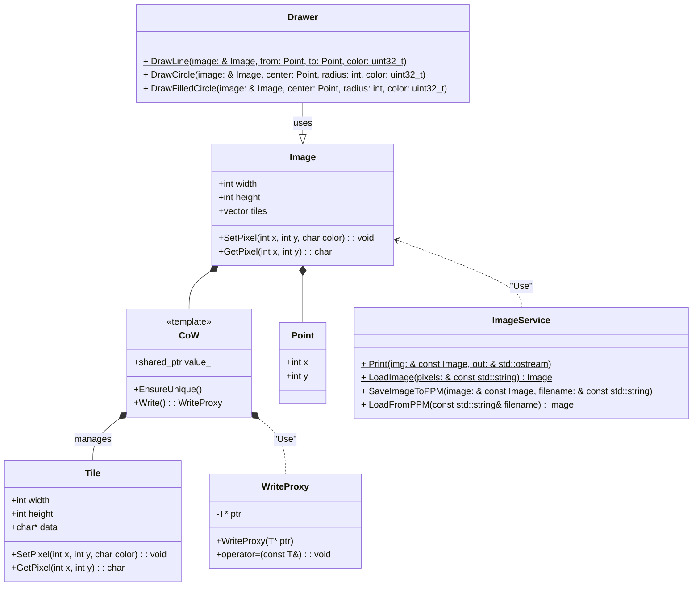

```mermaid
classDiagram
    class CoW {
        <<template>>
        +shared_ptr<T> value_
        +EnsureUnique()
        +Write(): WriteProxy
    }

    class WriteProxy {
        -T* ptr
        +WriteProxy(T* ptr)
        +operator=(const T&): void
    }

    class Tile {
        +int width
        +int height
        +char* data
        +SetPixel(int x, int y, char color): void
        +GetPixel(int x, int y): char
    }

    class Image {
        +int width
        +int height
        +vector<Tile> tiles
        +SetPixel(int x, int y, char color): void
        +GetPixel(int x, int y): char
    }

    class Point {
        +int x
        +int y
    }

    class Drawer {
        + DrawLine(image: & Image, from: Point, to: Point, color: uint32_t)$
        + DrawCircle(image: & Image, center: Point, radius: int, color: uint32_t)
        + DrawFilledCircle(image: & Image, center: Point, radius: int, color: uint32_t)
    }

    class ImageService {
        + Print(img: & const Image, out: & std::ostream)$
        + LoadImage(pixels: & const std::string) Image $
        + SaveImageToPPM(image: & const Image, filename: & const std::string)
        + LoadFromPPM(const std::string& filename) Image
    }

    CoW *-- Tile: manages
    Image *-- Point
    Image *-- CoW

    CoW *.. WriteProxy : "Use"
    Drawer --|> Image: uses
    Image <.. ImageService : "Use"
```